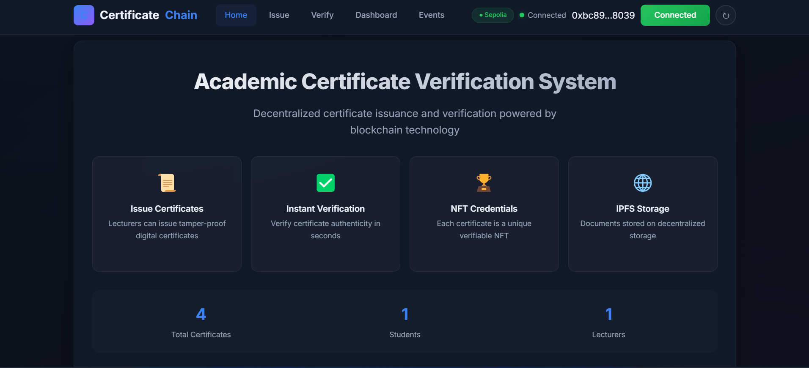
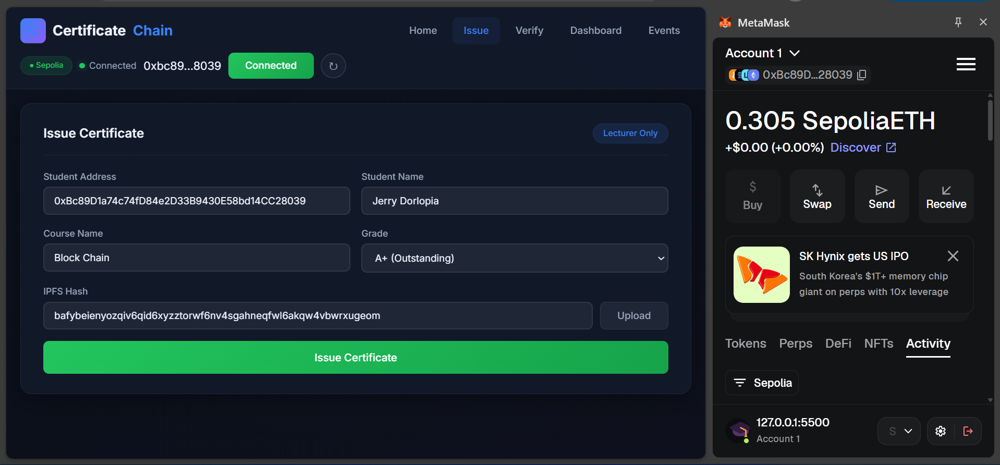
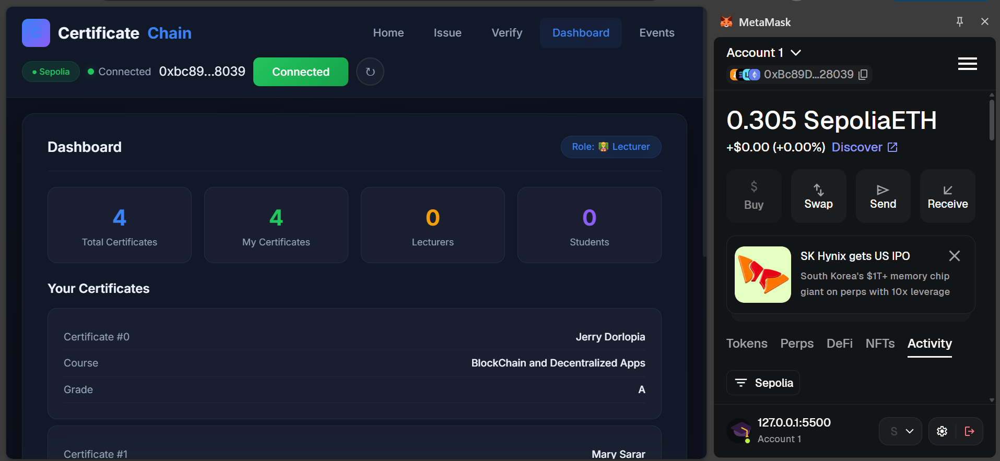
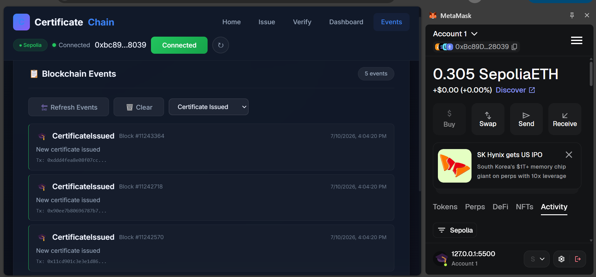
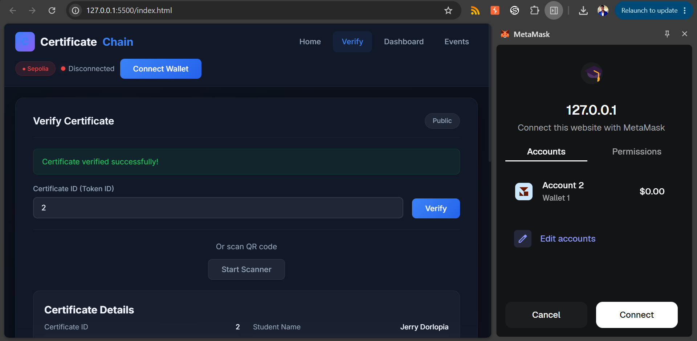
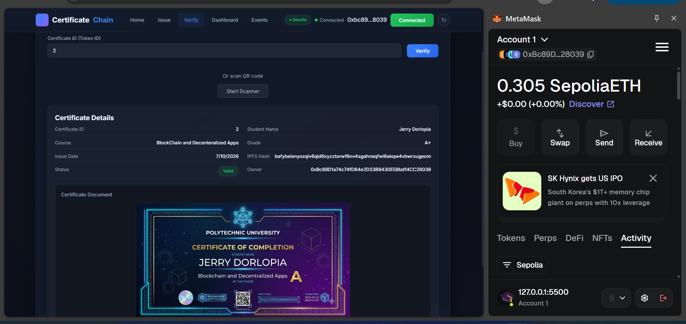

# 🎓 Blockchain Academic Certificate Verification System

A decentralized certificate issuance and verification system built on the Ethereum blockchain. This DApp enables academic institutions to issue tamper-proof digital certificates that employers can instantly verify online.

---

##  Team Members

| Name | Roll Number |
|------|-------------|
| **Jerry Dorlopia** | #202540686 |
| **Patch** | #202540687 |

---

##  Table of Contents

- [Overview](#-overview)
- [Features](#-features)
- [Screenshots](#-screenshots)
- [System Architecture](#-system-architecture)
- [Technologies Used](#-technologies-used)
- [Deployment](#-deployment)
- [Project Structure](#-project-structure)
- [Installation](#-installation)
- [Usage](#-usage)
- [Smart Contracts](#-smart-contracts)
- [Frontend](#-frontend)
- [Team](#-team)
- [License](#-license)

---

##  Overview

Certificate forgery is a growing problem, making it difficult for employers to verify graduates' qualifications. This system solves that by:

- **Issuing tamper-proof digital certificates** as NFTs
- **Storing certificate documents** on IPFS (decentralized storage)
- **Providing instant verification** without contacting institutions
- **Enabling employers to verify** certificates with a QR code scan

### Problem Statement

Universities continue to experience certificate forgery, making it difficult for employers to verify graduates' qualifications. The current system requires employers to contact institutions directly, which is time-consuming and inefficient.

### Our Solution

A decentralized certificate verification system where:
-  Lecturers can issue tamper-proof digital certificates
-  Employers can instantly verify certificates without contacting the institution
-  All certificates are stored on the blockchain (immutable)
-  Certificate documents are stored on IPFS (decentralized storage)
-  Each certificate is an NFT (unique, verifiable, owned by the student)

---

##  Features

### Backend Features
-  **Smart Contracts** - Solidity contracts for certificate issuance and verification
-  **Role-Based Access Control (RBAC)** - Admin, Lecturer, and Student roles
-  **NFT Integration** - ERC-721 compliant certificates
-  **IPFS Storage** - Decentralized file storage for certificate documents
-  **Blockchain Events** - Event logging for all actions

### Frontend Features
-  **Landing Page** - Professional introduction to the system
-  **MetaMask Authentication** - Secure wallet connection
-  **Certificate Issuance** - Lecturers can issue certificates
-  **Certificate Verification** - Anyone can verify certificates
-  **QR Code Scanner** - Scan QR codes for instant verification
-  **NFT Viewer** - View certificate NFT details
-  **Admin Dashboard** - Dashboard with statistics and certificate list
-  **Events Log** - View all blockchain events
-  **Professional Dark Theme** - Modern glassmorphism design

---

##  Screenshots

### Home Page

*The landing page showing system overview, features, and statistics.*

---

### Issue Certificate (Lecturer Only)

*Lecturers can issue tamper-proof digital certificates by filling in student details and confirming via MetaMask.*

---

### Dashboard

*Dashboard showing certificate statistics, total certificates, and the user's certificate list.*

---

### Events Log

*Real-time blockchain events display showing certificate issuance, verification, and other activities.*

---

### RBAC - Access Denied (Non-Lecturer)

*When a non-lecturer account tries to access the issue page, they see an "Access Denied" message, demonstrating Role-Based Access Control.*

---

### Certificate Verification

*Anyone can verify a certificate by entering the Token ID or scanning a QR code.*

---

---

##  Technologies Used

| Technology | Purpose |
|------------|---------|
| **Solidity** | Smart Contract Development |
| **OpenZeppelin** | ERC-721 & Ownable Standards |
| **Ethers.js** | Blockchain Interaction |
| **Hardhat** | Contract Testing & Deployment |
| **IPFS (Pinata)** | Decentralized Storage |
| **MetaMask** | Wallet Connection |
| **ZXing** | QR Code Scanning |
| **HTML/CSS/JS** | Frontend Development |

---

##  Deployment

### Smart Contracts (Sepolia Testnet)

| Contract | Address | Explorer |
|----------|---------|----------|
| **CertificateNFT** | `0x37cA1379B1dD7af5862CaAA1873Ce0aF3E037D99` | [View on Etherscan](https://sepolia.etherscan.io/address/0x37cA1379B1dD7af5862CaAA1873Ce0aF3E037D99) |
| **CertificateSystem** | `0x94fb6fcD345d639520468E58455bA9C6698877A7` | [View on Etherscan](https://sepolia.etherscan.io/address/0x94fb6fcD345d639520468E58455bA9C6698877A7) |

### Frontend

- **Live Demo**: `http://127.0.0.1:5500/frontend/index.html`
- **Local Development**: Open `frontend/index.html` in browser
